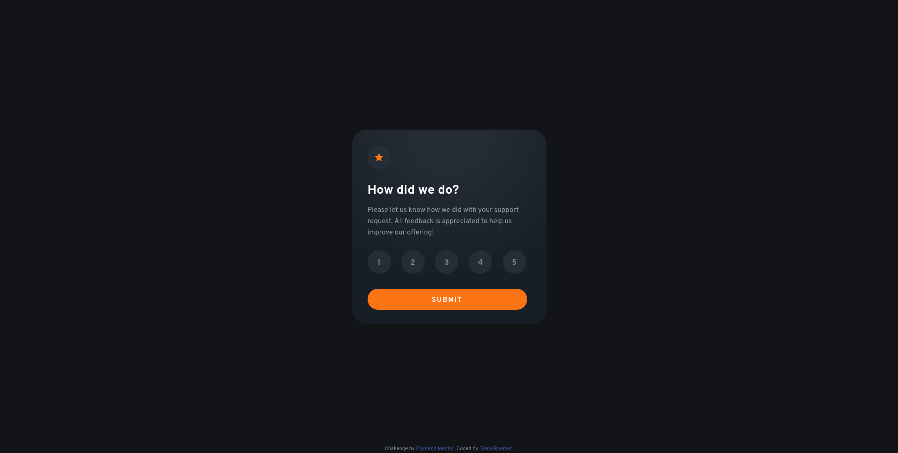
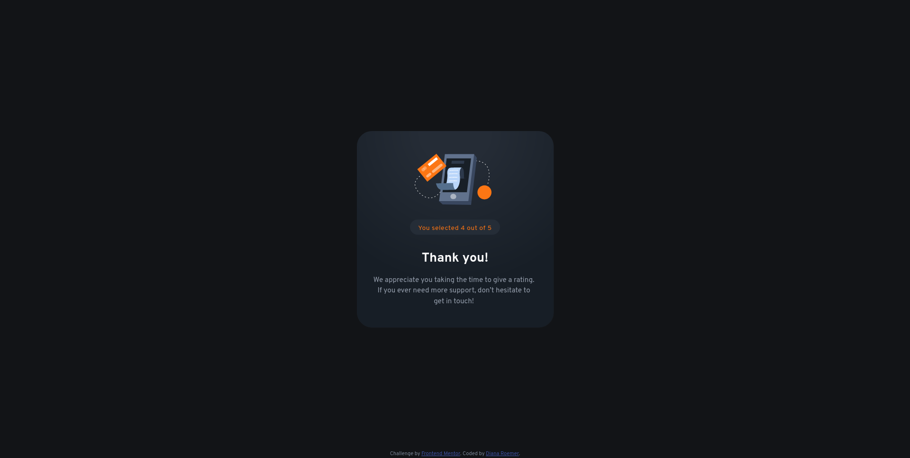
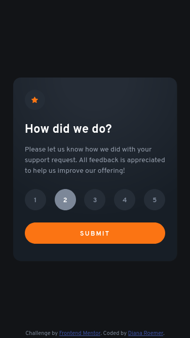

# [Frontend Mentor - Interactive rating component solution](https://dianaroemer.github.io/Interactive-Rating-Component/)

This is a solution to the [Interactive rating component challenge on Frontend Mentor](https://www.frontendmentor.io/challenges/interactive-rating-component-koxpeBUmI). Frontend Mentor challenges help you improve your coding skills by building realistic projects. 

## Table of contents

- [Overview](#overview)
  - [The challenge](#the-challenge)
  - [Screenshot](#screenshot)
  - [Links](#links)
- [My process](#my-process)
  - [Built with](#built-with)
  - [What I learned](#what-i-learned)
  - [Continued development](#continued-development)
  - [Useful resources](#useful-resources)
- [Author](#author)


## Overview

### The challenge

Users should be able to:

- View the optimal layout for the app depending on their device's screen size
- See hover states for all interactive elements on the page
- Select and submit a number rating
- See the "Thank you" card state after submitting a rating

### Screenshot





Add a screenshot of your solution. The easiest way to do this is to use Firefox to view your project, right-click the page and select "Take a Screenshot". You can choose either a full-height screenshot or a cropped one based on how long the page is. If it's very long, it might be best to crop it.

Alternatively, you can use a tool like [FireShot](https://getfireshot.com/) to take the screenshot. FireShot has a free option, so you don't need to purchase it. 

Then crop/optimize/edit your image however you like, add it to your project, and update the file path in the image above.

**Note: Delete this note and the paragraphs above when you add your screenshot. If you prefer not to add a screenshot, feel free to remove this entire section.**

### Links

- [Solution URL: ](https://github.com/dianaroemer/Interactive-Rating-Component)
- [Live Site URL: ](https://dianaroemer.github.io/Interactive-Rating-Component/)

## My process

### Built with

- Semantic HTML5 markup
- CSS custom properties
- Flexbox
- CSS Grid (for centering)
- Mobile-first workflow
- [React](https://reactjs.org/) - JS library
- [Sass](https://sass-lang.com//) - CSS Extension Language


### What I learned

Using Sass with React provided a mild challenge for implementation, as multiple .scss files are spread across the project - however Sass's ability to share heirarchical styling and CSS variables makes keeping consistent color data across every individual React component quite easy. I can see this being very powerful later on down the line.

```css
@use '_colors' as _colors;
.exampleDiv {
  color: _colors.$MediumGray;
}
```

In additional, creating modular class state objects in React has been a challenge in the past - I remember solving the problem by storing individual classNames in the components' state, and upon state updates, updating the components' class name in their respective render() calls, and allowing React to redraw each component. In this implementation, I was able to solve modular classNames based on state by creating an array that stores the button objects, which in turn creates the new objects variably as they get selected and de-selected, which cooperate with CSS's basic :hover pseudoclass. 

```js
    let valueButtons = [];
    for(let i = 1; i <= 5; i++){
        let className = (i === parseInt(props.clickedRating) ? 'valueButtonSelected' : 'valueButton');
        let valueButton = <button className={className}
                                value={i}
                                key={i}
                                onClick={(e) => {
                                    props.handleSetClickedRating(e, e.target.value)
                                }}>{i}</button>
        valueButtons.push(valueButton);
    }
    // And later, in the component's render or return
    <div>
      {valueButtons}
    </div>
```

I can see the above becoming a problem at scale - redrawing an array of five buttons is fairly straightforward, but imagine redrawing an entire movie database on Netflix when you want to update a single element's state. In that case, there's something to be said about calculating the optimal Big O across size - is re-rendering five elements over and over faster than rendering each element individually with slightly higher complexity and storage space, but with less calls over the lifetime of the sum of the objects (for example, individually managing button state and only updating singular buttons, as opposed to mapping across a large spread of buttons).

Also, learned that `event.target.value` automatically types as a `string`. While multiple source recommend converting that to a number at function call time by instead running `event.target.valueAsNumber`, I was unable to find success with that method. Instead, simply running a `parseInt(event.target.value)` brought success and appropriately typed my incoming value as an Int, though it may be computationally more expensive than otherwise.


Sneaky Radial-Gradient and 1px wide box-shadow on the bottom and right! These designs are really making you work for it, getting these colors right. I also feel like this is the second or third project in a row that has almost deliberately given all of the colors except for one (like the two in the color gradient background here).

Use this section to recap over some of your major learnings while working through this project. Writing these out and providing code samples of areas you want to highlight is a great way to reinforce your own knowledge.

To see how you can add code snippets, see below:

```html
<h1>Some HTML code I'm proud of</h1>
```
```css
.proud-of-this-css {
  color: papayawhip;
}
```
```js
const proudOfThisFunc = () => {
  console.log('🎉')
}
```

If you want more help with writing markdown, we'd recommend checking out [The Markdown Guide](https://www.markdownguide.org/) to learn more.

**Note: Delete this note and the content within this section and replace with your own learnings.**

### Continued development

Use this section to outline areas that you want to continue focusing on in future projects. These could be concepts you're still not completely comfortable with or techniques you found useful that you want to refine and perfect.

**Note: Delete this note and the content within this section and replace with your own plans for continued development.**

### Useful resources

- [Example resource 1](https://www.example.com) - This helped me for XYZ reason. I really liked this pattern and will use it going forward.
- [Example resource 2](https://www.example.com) - This is an amazing article which helped me finally understand XYZ. I'd recommend it to anyone still learning this concept.

**Note: Delete this note and replace the list above with resources that helped you during the challenge. These could come in handy for anyone viewing your solution or for yourself when you look back on this project in the future.**

## Author

- Website - [Diana Roemer](https://github.com/dianaroemer)
- Frontend Mentor - [@yourusername](https://www.frontendmentor.io/profile/dominicroemer)